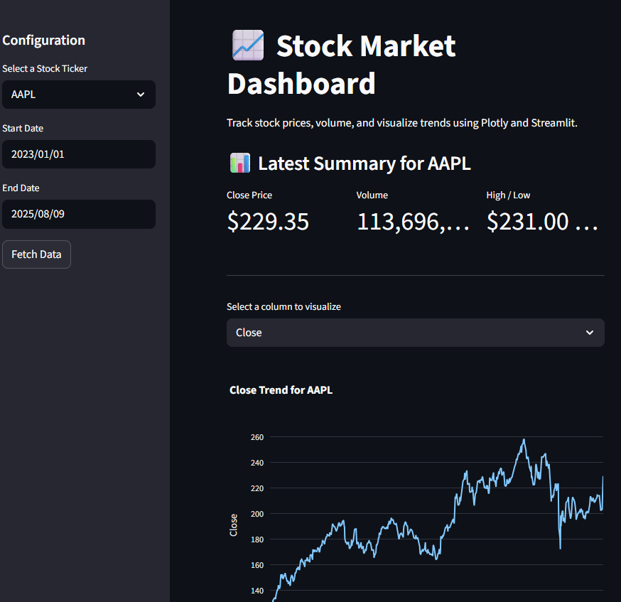
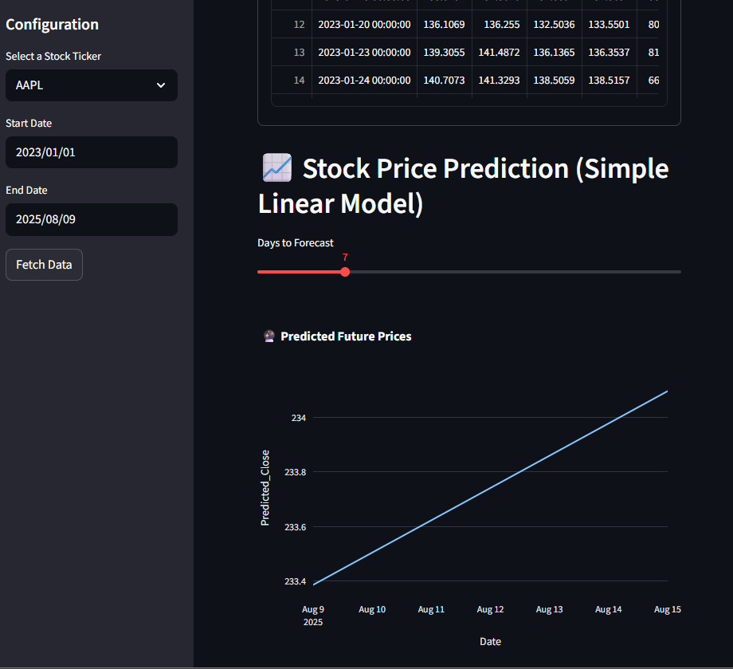

# Stock Market Dashboard

A **Streamlit-based interactive stock market dashboard** that allows you to fetch historical data, visualize trends, view key performance metrics, and perform simple stock price forecasting.
This tool uses **Yahoo Finance** as a data source and integrates **Plotly** for visualizations, along with a basic **Linear Regression model** for predictions.

---

## 🚀 Features

- **Multiple Stock Tickers**Quickly select from popular stocks (AAPL, MSFT, GOOGL, etc.) or enter your own.
- **Custom Date Range**Define the time period for fetching historical data.
- **Interactive Visualizations**Explore trends with interactive **Plotly** charts.
- **Key Metrics Dashboard**View latest closing price, volume, and daily high/low.
- **Raw Data Table**Inspect the fetched data in a clean, scrollable table.
- **Simple Price Forecasting**
  Use a **Linear Regression model** to predict future closing prices for 1–30 days ahead.

---

## 📦 Technologies Used

- **[Python](https://www.python.org/)**
- **[Streamlit](https://streamlit.io/)**
- **[yfinance](https://pypi.org/project/yfinance/)** – for fetching stock data
- **[Plotly](https://plotly.com/python/)** – for interactive charts
- **[scikit-learn](https://scikit-learn.org/stable/)** – for linear regression model
- **[NumPy](https://numpy.org/)** & **[Pandas](https://pandas.pydata.org/)** – for data manipulation

---

## 📂 Project Structure

```
stock-market-dashboard/
│
├── app.py                # Main Streamlit app
├── requirements.txt      # Python dependencies
└── README.md             # Project documentation
```

---

## ⚙️ Installation

1. **Clone this repository**

   ```bash
   git clone https://github.com/AbdulHadi117/Analytics-Dashboard.git
   cd stock-market-dashboard
   ```
2. **Create and activate a virtual environment (recommended)**

   ```bash
   python -m venv venv
   # Windows
   venv\Scripts\activate
   # macOS/Linux
   source venv/bin/activate
   ```
3. **Install dependencies**

   ```bash
   pip install -r requirements.txt
   ```

---

## ▶️ Usage

Run the app using:

```bash
streamlit run app.py
```

Then open the provided local URL in your browser (usually `http://localhost:8501`).

---

## 📊 Example Screenshots





## 🛠️ Future Improvements

- Add **multiple stock comparison** view.
- Include **ARIMA/Prophet** models for advanced time series forecasting.
- Add **download/export** option for charts and raw data.
- Integrate **real-time news sentiment analysis** for prediction enhancement.
- Implement **model evaluation metrics** (RMSE, MAE, R²).

---

## 🤝 Contributing

Contributions are welcome!If you'd like to improve the project, feel free to:

1. Fork the repository.
2. Create a new branch (`feature/your-feature`).
3. Commit your changes and open a pull request.

---

## 📧 Contact

Developed by **Abdul Hadi**

📩 Email: 117abdulhadi@gmail.com
